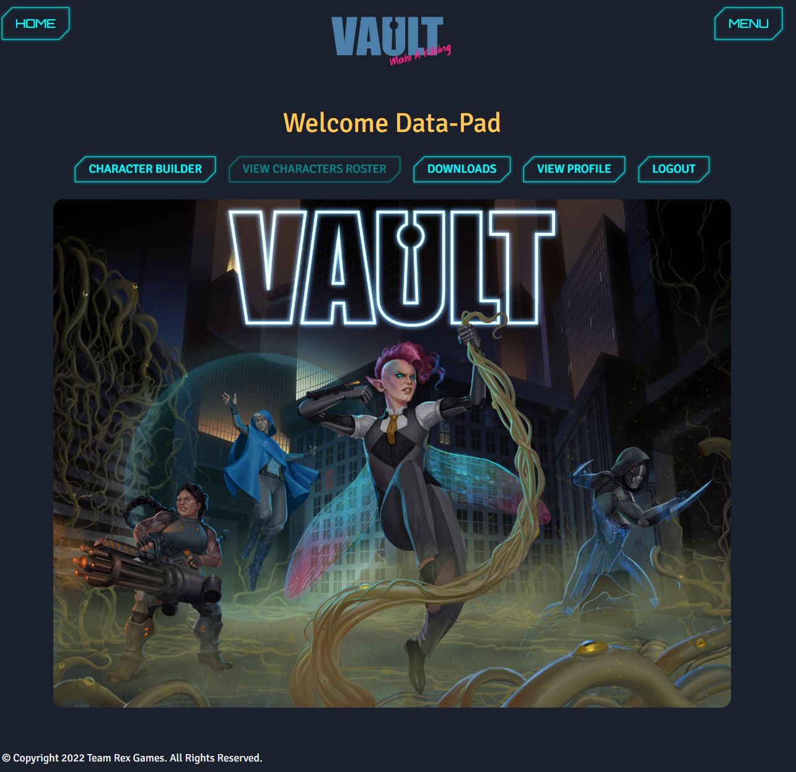
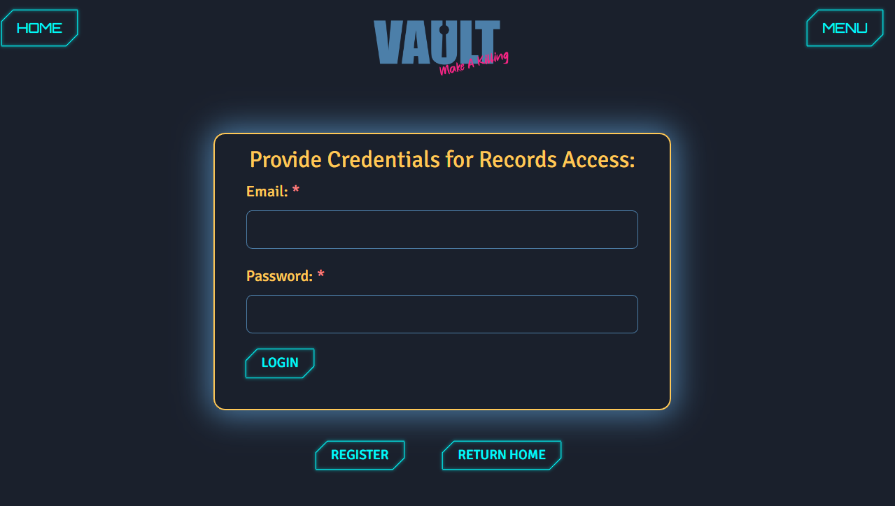
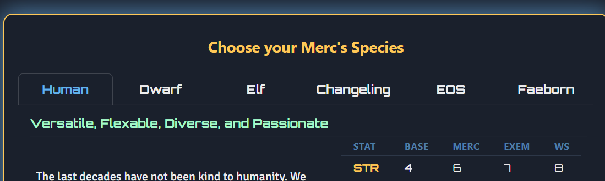
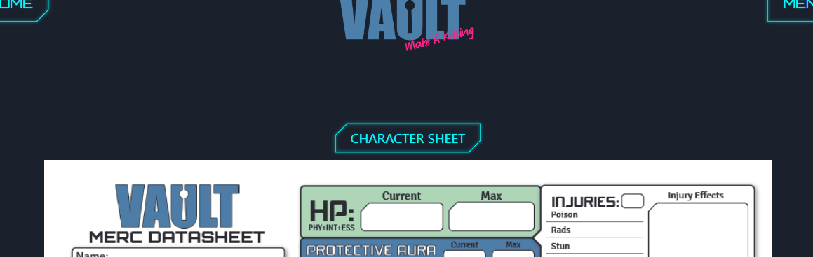
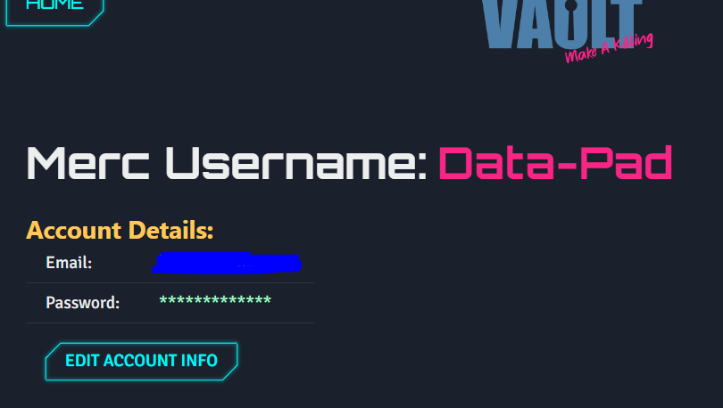
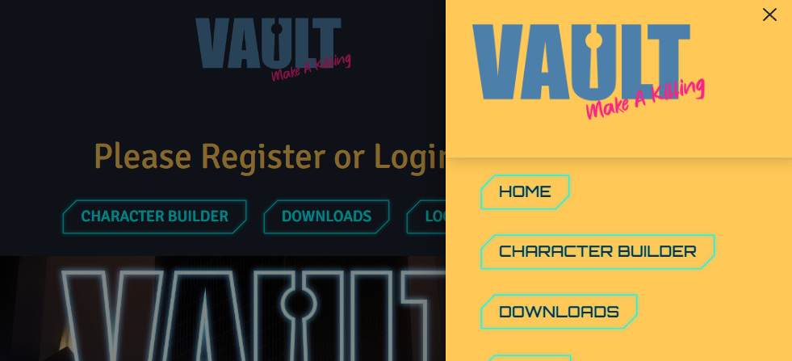

# vault-mk3 

## Description

## Table of Contents

- [Installation](#installation)
- [Usage](#usage)
- [Credits](#credits)
- [License](#license)

## Installation

    npm i

## Usage

## Credits

[GitHub Link](https://github.com/eeoerkeedu/vault-mk3)

[Business Site](https://www.teamrexgames.com/)

## License

    MIT

## Badges 

## Features

    MERN stack
    Chakra React UI
    PDF creation
    Local Storage
    User Management (auth) and Database Storage

## How to Contribute

    contact vaultrpginfo@gmail.com

## Tests

    no tests available
